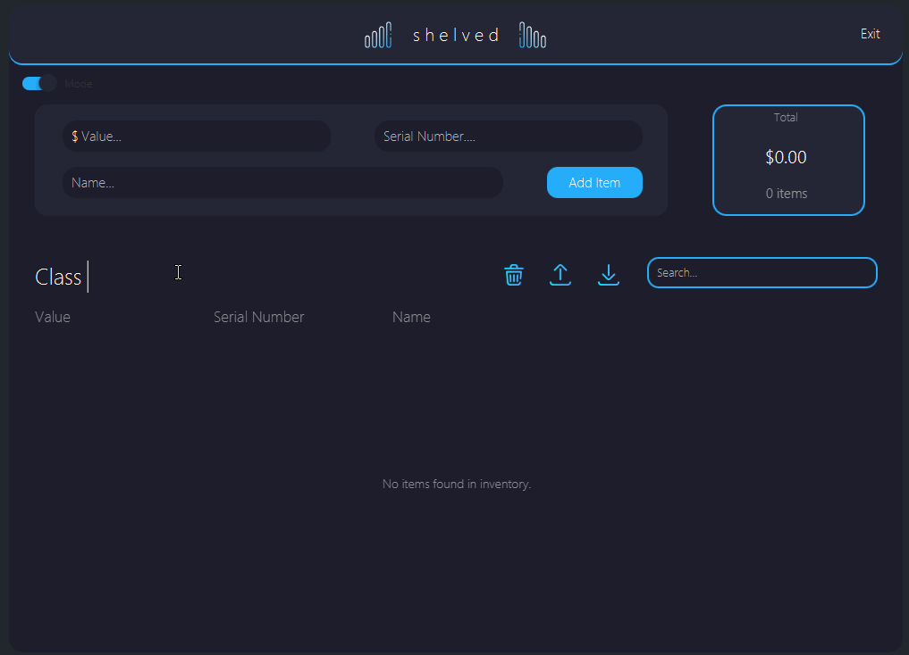

# Xaria Davis COP 3330 Application Assignment 2

Beginner project for COP3330

Shelved is a GUI-based desktop application that allows a user to track their personal inventory.

# Demo

# Directions

### Adding an item
To add an inventory item, enter its numerical value, serial number, and name into the textfields provided. The items should be entered in the specified format:
- Value: a numerical value
    - For example: 89 or 23.43
- Serial Number: XXXXXXXXXX a 10 digit indentifier where X represents either a number or a letter
    - For example: 1234567890 or A7S5F96DJ4
- Name: A string between 2 and 256 characters in length (inclusive) 
   - For example: iPhone or Playstation 5

Since the serial number and name fields both specify a character count, there is counter to help ensure you that you're entering a valid amount of characters.

##### Note
The program will show an alert if you attempt to add an item with an invalid format or an item with a serial number that already exists in the database.

### Removing an item
There are two ways to remove an item from the table:
1. Hover over the item and click on the X in the right of the item cell
2. Click on the item and click on the X in the far right of the item cell

### Editing an item
The program allows you to edit the value, serial number, and name of existing item in the database. Click on the cell you wish to edit and type the updated information in the textbox provided. Note that the format and serial number duplication constraints still apply here. 

### Sorting the table
The table allows you to sort by ascending or descending order by value, serial number, or name. Click the column title for the component you wish to sort and an arrow will appear. If the arrow is pointing upward, the list has been sorted it ascending order. If the list is pointed downward, the list has been sorted in descending order.

### Searching for an item 
To search for an item, simply type in the inquiry you want to search for. The table will update in real time based on the inquiry you enter in the box. To show the full list again, clear your search. Operations are still valid while searching. While searching you can add to the list, remove the searched item(s) from the list, edit the searched item(s), etc.

### Exporting
The application allows you to export your inventory as either and HTML or a TSV .txt file. To do this:
1. Click the export button. the filechooser window should appear.
2. Title your document
3. In the lower right hand side of the screen, choose whether you want to export as an HTML or a txt file.
4. Navigate to where you want to save your inventory file.
5. Click save.

### Importing 
The application allows you to import a previously saved HTML or a TSV .txt file to the inventory table for view or further modification. To do this:
1. Click the import button. the filechooser window should appear.
3. In the lower right hand side of the screen, choose whether you want to load an HTML or a txt file.
4. Navigate to where you saved your inventory file.
5. Click on the file.
6. Click open. 

